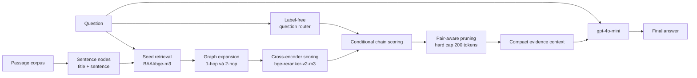

# Kế hoạch thí nghiệm cho paper

## 1. Mục tiêu nghiên cứu

Kiểm chứng rằng **Ours có thể dùng tối đa 200 evidence tokens nhưng vẫn giữ chất lượng câu trả lời cạnh tranh với các baseline được dùng tối đa 600 tokens** trên cả HotpotQA và 2WikiMultiHopQA.

Hai benchmark phải dùng cùng pipeline, model sinh câu trả lời, prompt, cách tính token và tập câu hỏi ghép cặp.

## 2. Luồng pipeline của hệ thống

**Bản minh hoạ HTML chi tiết:** [`pipeline.html`](pipeline.html)

**Đặc tả kỹ thuật từng bước:** [`pipeline.md`](pipeline.md)

### 2.1 Sơ đồ tổng quát

### 2.2 Input và output của từng block

| Bước | Block | Xử lý chính | Output |
|---:|---|---|---|
| 1 | Sentence preparation | Tách passage thành sentence node, biểu diễn dạng `title: sentence` | Tập node ứng viên |
| 2 | Seed retrieval | So khớp câu hỏi–node bằng BAAI/bge-m3, lấy các node gần nhất | Seed set `S0` |
| 3 | Graph construction/expansion | Tạo cạnh adjacency, entity-overlap và title-mention; mở rộng tối đa 2-hop | Candidate pool `C` |
| 4 | Semantic reranking | Cross-encoder chấm trực tiếp từng cặp question–candidate | Semantic score |
| 5 | Question routing | Phân loại label-free thành direct comparison, bridge comparison hoặc chained reasoning | Route của câu hỏi |
| 6 | Conditional chain scoring | Với route cần multi-hop, chọn anchor rồi chấm endpoint bằng `question + anchor`; direct comparison ưu tiên semantic coverage | Evidence chain/pair scores |
| 7 | Pair-aware pruning | Ưu tiên giữ cặp anchor–endpoint hoàn chỉnh, sau đó lấp budget bằng candidate tốt nhất | Evidence ≤200 tokens |
| 8 | Prompt construction | Ghép question, instruction và selected evidence; main mode group theo passage gốc, chain-aware order là ablation tùy chọn | Prompt cho LLM |
| 9 | Answer generation | gpt-4o-mini sinh câu trả lời, `temperature=0` | Final answer |
| 10 | Evaluation/logging | Tính SP/Answer metrics và ghi token, node, latency | `results.jsonl` và summary |

### 2.3 Routing và pruning của Ours

- **Direct comparison:** dùng semantic budget-fill; coverage bonus là tùy chọn và đang bằng 0 trong main configs.
- **Bridge comparison/chained reasoning:** dùng conditional single-chain để bảo vệ quan hệ anchor–endpoint dưới budget thấp.
- **QA mode chính:** single-chain, hard ceiling 200; đây là method dùng trong Main Comparison.
- **Evidence-recall mode:** dual-chain có thể tăng SP Recall nhưng giảm Answer F1; chỉ dùng trong ablation/RQ4.
- **PPR/linear semantic–graph blend:** là ablation lịch sử, không thuộc pipeline chính hiện tại. Graph chủ yếu giới hạn candidate pool; CE và conditional scoring quyết định thứ tự giữ evidence.

### 2.4 Điểm khác nhau giữa năm methods

| Method | Retrieval/ranking | Graph expansion | Routing/pair-aware pruning | Main budget |
|---|---|---|---|---:|
| Dense BI | Bi-encoder | Không | Không | 600 |
| Dense CE | Cross-encoder | Không | Không | 600 |
| Graph 1-hop CE | Cross-encoder | 1-hop | Không | 600 |
| Graph 2-hop CE | Cross-encoder | 2-hop | Không | 600 |
| **Ours** | Cross-encoder + conditional scoring | Tối đa 2-hop | **Có** | **200** |

`evidence_tokens` là ngân sách pruning. `prompt_tokens` còn bao gồm instruction, question, title và phần định dạng; hai đại lượng phải được báo cáo riêng.

## 3. Research Questions và thí nghiệm tương ứng

| RQ | Câu hỏi nghiên cứu | Thí nghiệm trả lời | Vai trò |
|---|---|---|---|
| **RQ1** | Ours-200 có giữ được chất lượng khi baseline được dùng 600 tokens không? | Main Comparison | **Thí nghiệm chính** |
| **RQ2** | Lợi ích đến từ pipeline hay chỉ do khác token budget? | Same-budget Control | Thí nghiệm phụ bắt buộc |
| **RQ3** | Hiệu quả thay đổi thế nào khi tăng/giảm budget? | Budget Sweep và Pareto Curve | Thí nghiệm phụ bắt buộc |
| **RQ4** | Thành phần nào của pipeline thực sự tạo ra cải thiện? | Ablation Study | Thí nghiệm phụ bắt buộc |
| **RQ5** | Pipeline mạnh/yếu ở loại câu hỏi nào và vì sao thất bại? | Robustness và Error Analysis | Thí nghiệm phụ bắt buộc |
| **RQ6** | Ours giảm bao nhiêu chi phí thực tế ngoài evidence tokens? | Runtime và Cost Analysis | Thí nghiệm phụ bắt buộc |

## 4. RQ1 — Main Comparison

Đây là **bảng kết quả chính của paper**.

- Baseline: hard ceiling 600 evidence tokens.
- Ours: hard ceiling 200 evidence tokens.
- Năm methods: Dense BI, Dense CE, Graph 1-hop CE, Graph 2-hop CE và Ours.
- Metrics: SP Recall, SP Precision, SP F1, Answer EM, Answer F1 và evidence tokens.
- Chạy riêng trên HotpotQA và 2WikiMultiHopQA.

Mục đích: chứng minh mức giảm token 2–3 lần trong điều kiện sử dụng thực tế mà vẫn giữ Answer F1 cạnh tranh.

## 5. RQ2 — Same-budget Control

Cho cả năm methods cùng hard ceiling **200 tokens**.

Mục đích: loại bỏ phản biện rằng kết quả chỉ xuất phát từ việc thay đổi budget. Đây là kiểm soát khoa học, không thay thế bảng 600-vs-200 chính.

## 6. RQ3 — Budget Sweep và Pareto Curve

Chạy các budget: **150, 200, 250, 300, 400, 500 và 600 tokens**.

Vẽ hai đường chính:

- Answer F1 theo evidence tokens.
- SP F1 theo evidence tokens.

Mục đích: kiểm tra Ours có nằm trên Pareto frontier và có đặc biệt hiệu quả ở budget thấp hay không. Trade-off curve được tạo từ kết quả này, không tính là một thí nghiệm độc lập.

## 7. RQ4 — Ablation Study

So sánh pipeline đầy đủ với các biến thể:

- Không graph expansion.
- Không question router.
- Không conditional reranking.
- Không pair-aware pruning.
- Single-chain và dual-chain.
- Semantic-only và graph-only.

Giữ cố định dataset, QID, model, prompt và budget 200. Mục đích: xác định đóng góp của từng block thay vì chỉ chứng minh toàn pipeline hoạt động.

## 8. RQ5 — Robustness và Error Analysis

Phân tích kết quả theo:

- Loại câu hỏi: bridge, comparison và các type của 2Wiki.
- Nhóm semantic-sufficient, semantic-blind và unrecoverable.
- Oracle reachability ở 1-hop và 2-hop.
- Tỷ lệ gold evidence có thể nằm trong budget 200.

Phần lớn phân tích này dùng lại output retrieval của main/ablation, vì vậy không nhất thiết gọi LLM thêm.

## 9. RQ6 — Runtime và Cost Analysis

Báo cáo cho từng method:

- Evidence tokens được chọn.
- Toàn bộ prompt input tokens và output tokens.
- Số node/câu được giữ lại.
- Retrieval/reranking latency.
- LLM latency và chi phí API ước tính.

Đo từng method bằng process riêng để tránh cache giữa methods làm sai so sánh runtime.

## 10. Phạm vi chạy cho mỗi benchmark

Mỗi benchmark có:

- **1 thí nghiệm chính:** RQ1.
- **5 nhóm thí nghiệm/phân tích phụ:** RQ2–RQ6.

Tổng cộng trên hai benchmark: **2 main comparisons và 10 nhóm phụ**. RQ5 có thể tái sử dụng kết quả; Pareto curve và bootstrap CI không tính là lượt thí nghiệm riêng.

## 11. Cỡ mẫu và cách báo cáo

- Pilot/debug: 200 câu, không dùng làm kết quả cuối paper.
- Thí nghiệm phụ khi tài nguyên hạn chế: cùng một tập ghép cặp tối thiểu 1.000 câu mỗi benchmark.
- Main Comparison cuối: chạy full HotpotQA và full 2WikiMultiHopQA.
- Dùng cùng QID cho mọi method, seed cố định và `temperature=0`.
- Báo paired bootstrap 95% CI với 10.000 resamples cho các chênh lệch chính.
- Phân biệt rõ `evidence_tokens`, `prompt_tokens` và `output_tokens`.

## 12. Thứ tự ưu tiên chạy

1. RQ1 Main Comparison full benchmark.
2. RQ2 Same-budget Control.
3. RQ3 Budget Sweep.
4. RQ4 Ablation.
5. RQ5 Robustness/Error Analysis.
6. RQ6 Runtime/Cost Analysis.
