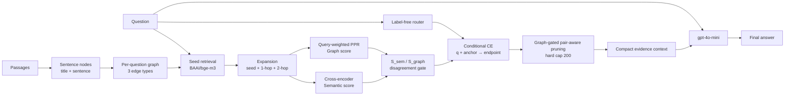

# Experimental Design v2 — Evidence-Efficient Multi-Hop QA

## 1. Mục tiêu nghiên cứu

Kiểm chứng rằng **Ours v2 dùng tối đa 200 evidence tokens nhưng vẫn giữ chất lượng câu trả lời cạnh tranh với các baseline được dùng tối đa 600 tokens** trên cả HotpotQA và 2WikiMultiHopQA.

> **Kết quả pilot v0.1:** các bảng đã điền theo từng RQ nằm tại [`result_v0.1/summary.md`](result_v0.1/summary.md). HotpotQA đã đủ 200/200; 2Wiki đang được cập nhật theo checkpoint và mọi bảng luôn hiển thị cột `N`/trạng thái. Các bảng dấu `—` phía dưới vẫn là template thiết kế thực nghiệm, không phải kết quả đã chạy.

Thiết kế tập trung vào pain point giảm context. Graph score là một thành phần của pipeline, không phải mục tiêu duy nhất của toàn bộ phần thực nghiệm.

## 2. Pipeline được giữ cố định

Tài liệu kỹ thuật đầy đủ nằm tại [`pipeline.md`](pipeline.md); bản minh hoạ node/edge nằm tại [`pipeline.html`](pipeline.html).

### 2.1 Sơ đồ end-to-end



### 2.2 Input, xử lý và output từng block

| Bước | Block | Input | Xử lý | Output |
|---:|---|---|---|---|
| 0 | QA input | Question và passage set của một QID | Không truy vấn toàn bộ Wikipedia; dùng passages benchmark cung cấp | `QAItem` |
| 1 | Sentence preparation | Passages | Tách passage thành sentences; biểu diễn embedding dạng `title: sentence` | Sentence nodes `V` |
| 2 | Graph construction | Sentence nodes | Nối adjacency, entity-overlap và title-mention | Per-question graph `G=(V,E)` |
| 3 | Seed retrieval | Question và tất cả nodes | BAAI/bge-m3 cosine similarity, lấy Top-5 | Seed set `S0` |
| 4 | Graph expansion | `G` và `S0` | Multi-source BFS, giữ node cách seed tối đa 2-hop | Candidate pool `C` |
| 5 | Semantic scoring | Question và `C` | BAAI/bge-reranker-v2-m3 chấm `CE(q,v)` | Semantic score/candidate |
| 6 | Graph scoring | Graph, seeds và semantic seed strengths | Personalized PageRank với semantic-weighted restart | GraphRel/candidate |
| 7 | Proxy sets | Semantic và GraphRel | Tạo Top-6 `S_sem`, Top-6 `S_graph`, tính disagreement | Query graph gate `λ(q)` |
| 8 | Question routing | Question text | Label-free route, không dùng benchmark type/gold | Direct, bridge-comparison hoặc chained route |
| 9 | Conditional scoring | Question, semantic anchor và graph neighbors | Chấm endpoint bằng `CE(q + anchor, endpoint)` | Conditional score và anchor key |
| 10 | Pruning | Các score, pair structure và budget | Graph-gated ranking; giữ anchor–endpoint pair | Selected evidence ≤200 tokens |
| 11 | Prompt/answer | Question và selected evidence | Group evidence theo passage gốc, gọi gpt-4o-mini, `temperature=0` | Prediction |
| 12 | Evaluation | Prediction, selected evidence và gold | Tính SP/Answer metrics, tokens, nodes và latency | `results.jsonl` |

Passage là đơn vị dữ liệu nguồn; **sentence mới là graph node và đơn vị được rerank/prune**. Gold answer/supporting facts chỉ được dùng ở bước evaluation hoặc oracle diagnostic.

### 2.3 Graph construction

| Edge | Điều kiện | Vai trò |
|---|---|---|
| `same_passage` | Hai sentence liền nhau trong cùng passage | Giữ mạch nội dung cục bộ |
| `entity_overlap` | Hai sentence khác passage có entity chung | Nối evidence qua bridge entity |
| `title_mention` | Sentence ở passage A nhắc title của passage B | Nối trực tiếp hai bài viết liên quan |

Expansion dùng hop không trọng số; weighted PPR sử dụng trọng số edge. Candidate lưu hop distance, shortest seed path và graph neighbors để phục vụ conditional pair selection.

### 2.4 Công thức chính

```text
Semantic(v) = CE(q, v)

SeedWeight(s) = softmax(Semantic(q,s) / 0.20)

GraphRel(v) = WeightedPPR(v) / max WeightedPPR

S_sem   = Top-6 theo Semantic
S_graph = Top-6 theo GraphRel

Disagreement(q)
  = 1 - |S_sem ∩ S_graph| / |S_sem ∪ S_graph|

λ(q) = 0.20 × Disagreement(q)

FinalRank(v)
  = SemanticRank(v)
  + 0.30 × ConditionalRank(v)
  + λ(q) × GraphRescue(v)
```

Graph residual chỉ áp dụng khi `v ∈ S_graph − S_sem`, có graph-connected anchor và được conditional CE xác nhận. Hyperparameter được giữ giống nhau trên hai benchmark.

### 2.5 Routing và selection policy

| Route | Dấu hiệu | Policy hiện tại |
|---|---|---|
| Direct comparison | So sánh entity/thuộc tính xuất hiện trực tiếp | Semantic budget-fill; không kích hoạt graph residual |
| Bridge comparison | Cần intermediate relation rồi mới so sánh | Single-chain conditional scoring + graph-gated rescue |
| Chained reasoning | Cần đi qua bridge entity để tìm answer | Conditional anchor–endpoint scoring + graph-gated rescue |

Graph score không được cộng vào mọi candidate. Nó chỉ là residual nhỏ cho semantic misses đã được conditional CE xác nhận. Khi endpoint được chọn, anchor tương ứng cũng phải được giữ nếu cả pair vừa budget.

### 2.6 Context, generation và token accounting

Main mode group selected sentences theo passage title và sentence order gốc. Chain-aware serialization là ablation tùy chọn, không thuộc main result.

Ba đại lượng phải báo cáo riêng:

| Token metric | Bao gồm |
|---|---|
| Evidence/context tokens | Chỉ selected sentence text; Ours hard cap 200 |
| Prompt tokens | Instruction + titles/format + evidence + question |
| Output tokens | Answer do LLM sinh |

## 3. Research Questions

| RQ | Câu hỏi nghiên cứu | Thí nghiệm trả lời | Vai trò |
|---|---|---|---|
| **RQ1** | Ours-200 có giữ chất lượng cạnh tranh với baseline-600 không? | Main Comparison | **Thí nghiệm chính** |
| **RQ2** | Khi cùng budget, lợi ích có đến từ pipeline thay vì chênh lệch token không? | Same-budget Control | Bắt buộc |
| **RQ3** | Chất lượng thay đổi thế nào theo token budget? | Budget Sweep và Pareto Curve | Bắt buộc |
| **RQ4** | Thành phần nào của pipeline thực sự tạo ra cải thiện? | Component Ablation | Bắt buộc |
| **RQ5** | Pipeline có tổng quát qua benchmark/question type và thất bại ở đâu? | Robustness và Error Analysis | Bắt buộc |
| **RQ6** | Pipeline giảm bao nhiêu context, latency và chi phí thực tế? | Efficiency và Cost Analysis | Bắt buộc |

## 4. Protocol chung và fairness

Ours sử dụng cross-encoder, vì vậy các baseline chính cũng sử dụng cùng BAAI/bge-reranker-v2-m3.

| Method | Pipeline | Main budget |
|---|---|---:|
| Dense CE | CE chấm trực tiếp sentence set, không graph | 600 |
| Graph 1-hop CE | Seed → graph 1-hop → CE ranking | 600 |
| Graph 2-hop CE | Seed → graph 2-hop → CE ranking | 600 |
| **Ours v2** | 2-hop + CE + graph score + router + conditional pair pruning | **200** |

Mọi method dùng cùng:

- Passage input và paired QID.
- Cross-encoder semantic model.
- gpt-4o-mini, `temperature=0`.
- Prompt template và tokenizer `cl100k_base`.
- Evaluation code.

Graph-based methods dùng chung BAAI/bge-m3 seed retrieval. Dense CE không cần seed vì chấm trực tiếp toàn bộ sentence set.

## 5. RQ1 — Main Comparison

### RQ1

> Với hard ceiling 200 evidence tokens, Ours có giữ Answer F1 cạnh tranh với baseline được dùng tối đa 600 tokens không?

### 5.1 Bảng chính thống nhất cho hai benchmark

| Dataset | Method | Budget | SP Recall ↑ | SP Precision ↑ | SP F1 ↑ | Answer EM ↑ | Answer F1 ↑ | Evidence Tokens ↓ | Nodes ↓ |
|---|---|---:|---:|---:|---:|---:|---:|---:|---:|
| HotpotQA | Dense CE | 600 | — | — | — | — | — | — | — |
| HotpotQA | Graph 1-hop CE | 600 | — | — | — | — | — | — | — |
| HotpotQA | Graph 2-hop CE | 600 | — | — | — | — | — | — | — |
| HotpotQA | **Ours v2** | **200** | — | — | — | — | — | — | — |
| 2Wiki | Dense CE | 600 | — | — | — | — | — | — | — |
| 2Wiki | Graph 1-hop CE | 600 | — | — | — | — | — | — | — |
| 2Wiki | Graph 2-hop CE | 600 | — | — | — | — | — | — | — |
| 2Wiki | **Ours v2** | **200** | — | — | — | — | — | — | — |

### 5.2 Paired compression/non-inferiority

| Dataset | Comparator | Token ratio ↑ | ΔSP Recall | ΔSP F1 | ΔAnswer EM | ΔAnswer F1 | 95% CI ΔAnswer F1 | Kết luận |
|---|---|---:|---:|---:|---:|---:|---|---|
| HotpotQA | Dense CE | — | — | — | — | — | — | — |
| HotpotQA | Graph 1-hop CE | — | — | — | — | — | — | — |
| HotpotQA | Graph 2-hop CE | — | — | — | — | — | — | — |
| 2Wiki | Dense CE | — | — | — | — | — | — | — |
| 2Wiki | Graph 1-hop CE | — | — | — | — | — | — | — |
| 2Wiki | Graph 2-hop CE | — | — | — | — | — | — | — |

```text
Token ratio = comparator mean evidence tokens / Ours mean evidence tokens
Delta       = Ours - comparator
```

Answer F1 được xem là non-inferior nếu lower bound của paired bootstrap CI không thấp hơn `−0.02`.

## 6. RQ2 — Same-budget Control

### RQ2

> Khi cả baseline và Ours đều bị giới hạn ở 200 tokens, pipeline của Ours có còn tạo lợi thế không?

| Dataset | Method | Budget | SP Recall | SP Precision | SP F1 | Answer EM | Answer F1 | Tokens |
|---|---|---:|---:|---:|---:|---:|---:|---:|
| HotpotQA | Dense CE | 200 | — | — | — | — | — | — |
| HotpotQA | Graph 1-hop CE | 200 | — | — | — | — | — | — |
| HotpotQA | Graph 2-hop CE | 200 | — | — | — | — | — | — |
| HotpotQA | **Ours v2** | 200 | — | — | — | — | — | — |
| 2Wiki | Dense CE | 200 | — | — | — | — | — | — |
| 2Wiki | Graph 1-hop CE | 200 | — | — | — | — | — | — |
| 2Wiki | Graph 2-hop CE | 200 | — | — | — | — | — | — |
| 2Wiki | **Ours v2** | 200 | — | — | — | — | — | — |

RQ2 là fairness control, không thay thế bảng 600-vs-200 của RQ1.

## 7. RQ3 — Budget Sweep và Pareto Curve

### RQ3

> Ours có đặc biệt hiệu quả ở budget thấp và có tạo quality–token Pareto frontier tốt hơn không?

Budget dùng chung: `100, 150, 200, 300, 400, 600`.

### 7.1 Answer F1 theo budget

| Dataset | Method | 100 | 150 | 200 | 300 | 400 | 600 |
|---|---|---:|---:|---:|---:|---:|---:|
| HotpotQA | Dense CE | — | — | — | — | — | — |
| HotpotQA | Graph 1-hop CE | — | — | — | — | — | — |
| HotpotQA | Graph 2-hop CE | — | — | — | — | — | — |
| HotpotQA | Ours v2 | — | — | — | — | — | — |
| 2Wiki | Dense CE | — | — | — | — | — | — |
| 2Wiki | Graph 1-hop CE | — | — | — | — | — | — |
| 2Wiki | Graph 2-hop CE | — | — | — | — | — | — |
| 2Wiki | Ours v2 | — | — | — | — | — | — |

### 7.2 SP F1 theo budget

Dùng cùng cấu trúc bảng trên nhưng thay metric bằng SP F1. Tạo hai figure từ cùng output:

1. Answer F1 theo evidence tokens.
2. SP F1 theo evidence tokens.

Pareto curve không tính là một lượt thí nghiệm độc lập.

## 8. RQ4 — Component Ablation

### RQ4

> Router, conditional scoring, graph score và pair-aware pruning đóng góp như thế nào vào kết quả cuối?

| Variant | Thay đổi | Mục đích |
|---|---|---|
| **Full Ours v2** | Không thay đổi | Reference |
| `−GraphScore` | `λ_max=0` | Đóng góp của graph score |
| Uniform PPR | Bỏ semantic seed weighting | Đóng góp của query-weighted restart |
| `−DisagreementGate` | Dùng graph weight cố định | Đóng góp của query gate |
| `−Router` | Mọi câu dùng cùng policy | Đóng góp của routing |
| `−ConditionalScoring` | Bỏ CE(q+anchor,endpoint) | Đóng góp của second-hop validation |
| `−PairPreservation` | Chọn node độc lập | Đóng góp của chain completeness |
| Graph-only | Bỏ semantic base relevance | Sanity lower bound |

### 8.1 Bảng ablation thống nhất

| Dataset | Variant | SP Recall | SP Precision | SP F1 | Answer EM | Answer F1 | Tokens |
|---|---|---:|---:|---:|---:|---:|---:|
| HotpotQA | Full Ours v2 | — | — | — | — | — | — |
| HotpotQA | −GraphScore | — | — | — | — | — | — |
| HotpotQA | Uniform PPR | — | — | — | — | — | — |
| HotpotQA | −DisagreementGate | — | — | — | — | — | — |
| HotpotQA | −Router | — | — | — | — | — | — |
| HotpotQA | −ConditionalScoring | — | — | — | — | — | — |
| HotpotQA | −PairPreservation | — | — | — | — | — | — |
| HotpotQA | Graph-only | — | — | — | — | — | — |
| 2Wiki | Full Ours v2 | — | — | — | — | — | — |
| 2Wiki | −GraphScore | — | — | — | — | — | — |
| 2Wiki | Uniform PPR | — | — | — | — | — | — |
| 2Wiki | −DisagreementGate | — | — | — | — | — | — |
| 2Wiki | −Router | — | — | — | — | — | — |
| 2Wiki | −ConditionalScoring | — | — | — | — | — | — |
| 2Wiki | −PairPreservation | — | — | — | — | — | — |
| 2Wiki | Graph-only | — | — | — | — | — | — |

Graph score chỉ là một dòng ablation bên cạnh các block khác; RQ4 đánh giá toàn bộ kiến trúc.

## 9. RQ5 — Robustness, Generalization và Error Analysis

### RQ5

> Pipeline có tổng quát từ Hotpot sang 2Wiki, hoạt động tốt ở question type nào và thất bại ở block nào?

### 9.1 Breakdown theo question type

| Dataset | Question type | N | SP Recall | SP F1 | Answer EM | Answer F1 | Tokens |
|---|---|---:|---:|---:|---:|---:|---:|
| HotpotQA | Bridge | — | — | — | — | — | — |
| HotpotQA | Comparison | — | — | — | — | — | — |
| 2Wiki | Comparison | — | — | — | — | — | — |
| 2Wiki | Inference | — | — | — | — | — | — |
| 2Wiki | Compositional | — | — | — | — | — | — |
| 2Wiki | Bridge comparison | — | — | — | — | — | — |

### 9.2 Phân nhóm theo mức độ cần graph

Với cùng hard ceiling 200, tạo hai selection phục vụ chẩn đoán:

```text
S_sem   = selection theo semantic-only
S_graph = selection theo graph-only
E*      = gold supporting evidence
```

Mỗi câu hỏi được gán vào đúng một nhóm:

- **Semantic-sufficient:** `E* ⊆ S_sem`.
- **Semantic-blind:** `E* ⊄ S_sem` nhưng `E* ⊆ (S_sem ∪ S_graph)`.
- **Unrecoverable:** `E* ⊄ (S_sem ∪ S_graph)`.

Các nhóm này chỉ dùng gold để phân tích sau inference, không được đưa vào router hoặc selector.

| Dataset | Nhóm | N | Tỷ lệ | Ours SP Recall | Ours SP F1 | Answer F1 | Tokens |
|---|---|---:|---:|---:|---:|---:|---:|
| HotpotQA | Semantic-sufficient | — | — | — | — | — | — |
| HotpotQA | Semantic-blind | — | — | — | — | — | — |
| HotpotQA | Unrecoverable | — | — | — | — | — | — |
| 2Wiki | Semantic-sufficient | — | — | — | — | — | — |
| 2Wiki | Semantic-blind | — | — | — | — | — | — |
| 2Wiki | Unrecoverable | — | — | — | — | — | — |

### 9.3 Oracle reachability và khả thi của budget 200

Oracle probe tách hai loại bottleneck:

1. Gold evidence không xuất hiện trong candidate pool sau graph expansion.
2. Gold evidence có trong pool nhưng selector không giữ được dưới budget 200.

| Dataset | 1-hop gold recall | 2-hop gold recall | Full-gold reachable ≤2-hop | Mean gold tokens | Gold fit ≤200 |
|---|---:|---:|---:|---:|---:|
| HotpotQA | — | — | — | — | — |
| 2Wiki | — | — | — | — | — |

Báo thêm oracle theo question type, đặc biệt Hotpot bridge và 2Wiki bridge-comparison.

### 9.4 Graph rescue diagnostic

| Dataset/type | Rescue activated | Correct rescue | False rescue | Gold added | Gold displaced | ΔAnswer F1 |
|---|---:|---:|---:|---:|---:|---:|
| HotpotQA — All | — | — | — | — | — | — |
| HotpotQA — Bridge | — | — | — | — | — | — |
| HotpotQA — Comparison | — | — | — | — | — | — |
| 2Wiki — All | — | — | — | — | — | — |
| 2Wiki — Bridge comparison | — | — | — | — | — | — |
| 2Wiki — Compositional | — | — | — | — | — | — |

`Correct rescue` nghĩa là graph residual đưa thêm gold evidence vào selected context; `false rescue` nghĩa là node được nâng hạng nhưng không thuộc gold evidence. `Gold displaced` đo trường hợp graph rescue làm một gold node khác bị bật khỏi budget.

### 9.5 Failure taxonomy

| Failure stage | Điều kiện chẩn đoán | N | Tỷ lệ |
|---|---|---:|---:|
| Seed miss | Gold bridge không gần bất kỳ seed nào | — | — |
| Graph reachability miss | Gold không nằm trong candidate pool ≤2-hop | — | — |
| Router error | Route được chọn không phù hợp với evidence structure | — | — |
| Graph false rescue | Non-gold graph candidate chiếm budget | — | — |
| Conditional scoring error | Gold endpoint tồn tại nhưng conditional CE xếp thấp | — | — |
| Pair/pruning error | Gold pair đủ budget nhưng không được giữ | — | — |
| Budget infeasible | Tổng gold evidence vượt 200 tokens | — | — |
| Generation error | Selected context đủ gold nhưng answer sai | — | — |

RQ5 chủ yếu tái sử dụng candidate/selection output của RQ1 và RQ4. Chỉ cần gọi LLM bổ sung nếu raw result chưa có prediction cho QID cần phân tích.

## 10. RQ6 — Efficiency và Cost

### RQ6

> Ours giảm bao nhiêu context và chi phí, đồng thời thêm bao nhiêu retrieval overhead?

| Dataset | Method | Evidence tokens | Prompt tokens | Output tokens | Nodes | Retrieval latency | LLM latency | Cost/question |
|---|---|---:|---:|---:|---:|---:|---:|---:|
| HotpotQA | Dense CE | — | — | — | — | — | — | — |
| HotpotQA | Graph 1-hop CE | — | — | — | — | — | — | — |
| HotpotQA | Graph 2-hop CE | — | — | — | — | — | — | — |
| HotpotQA | **Ours v2** | — | — | — | — | — | — | — |
| 2Wiki | Dense CE | — | — | — | — | — | — | — |
| 2Wiki | Graph 1-hop CE | — | — | — | — | — | — | — |
| 2Wiki | Graph 2-hop CE | — | — | — | — | — | — | — |
| 2Wiki | **Ours v2** | — | — | — | — | — | — | — |

Runtime phải đo từng method bằng process riêng. Không đánh tráo `evidence_tokens`, `prompt_tokens` và `output_tokens`.

## 11. Cỡ mẫu và kế hoạch chạy

| Phần | Retrieval | LLM generation |
|---|---|---|
| Pilot/debug | 200 câu/benchmark | 200 câu/benchmark |
| RQ1 main | Full Hotpot + full 2Wiki | 2.000 paired câu/benchmark; full nếu đủ tài nguyên |
| RQ2 same-budget | 2.000 paired câu/benchmark | Cùng 2.000 QID của RQ1 |
| RQ3 budget sweep | Full hoặc tối thiểu 2.000/benchmark | 1.000 paired câu/benchmark |
| RQ4 ablation | 1.000 paired câu/benchmark | Cùng 1.000 QID |
| RQ5 | Tái sử dụng output | Không gọi thêm nếu không cần |
| RQ6 | Instrument các run trên | Tái sử dụng usage logs |

Nếu Answer EM/F1 không chạy full, paper phải ghi rõ sample size, sampling procedure và QID. Không trình bày subset result như full benchmark result.

## 12. Statistical protocol

- Cùng QID cho mọi method trong từng RQ.
- Sampling stratified theo question type, seed 0.
- Calibration/tuning QID tách khỏi final evaluation QID.
- Paired bootstrap CI 95%, 10.000 resamples.
- Báo mean delta và CI, không chỉ bold mean tốt nhất.
- Config SHA-256 và code revision trong mỗi result row.

## 13. Thứ tự ưu tiên

1. Freeze pipeline và hyperparameter dùng chung.
2. RQ1 main comparison.
3. RQ2 same-budget fairness control.
4. RQ3 budget sweep/Pareto curve.
5. RQ4 component ablation.
6. RQ5 type/oracle/failure analysis.
7. RQ6 runtime, tokens và cost.

## 14. Tiêu chí thành công

Paper đạt pain point khi:

1. Ours không vượt 200 evidence tokens.
2. Giảm ít nhất 2× tokens so với comparator chính.
3. Answer F1 đạt non-inferiority margin `−0.02` theo paired CI.
4. SP F1 hoặc SP Precision cải thiện rõ ràng.
5. Xu hướng không đảo chiều nghiêm trọng giữa Hotpot và 2Wiki.
6. Same-budget RQ2 cho thấy lợi ích không chỉ đến từ budget khác nhau.

## 15. Pilot hiện có — không dùng làm final result

| Dataset | Variant | SP Recall | SP F1 | Answer EM | Answer F1 | Tokens |
|---|---|---:|---:|---:|---:|---:|
| HotpotQA | Ours không graph score | **0.8809** | **0.4830** | 0.5450 | 0.6999 | 195.5 |
| HotpotQA | Ours v2 graph-gated | 0.8793 | 0.4818 | — | — | 195.5 |
| 2Wiki | Ours không graph score | 0.8225 | 0.4121 | **0.4950** | **0.5940** | 192.9 |
| 2Wiki | Ours v2 graph-gated | **0.8238** | **0.4144** | 0.4900 | 0.5865 | **192.7** |

Pilot cho thấy graph score hiện tạo evidence–answer trade-off. RQ4 phải báo cáo trung thực đóng góp này, nhưng RQ1–RQ6 vẫn đánh giá mục tiêu tổng thể của pipeline: **ít context hơn mà chất lượng trả lời vẫn được bảo đảm**.
